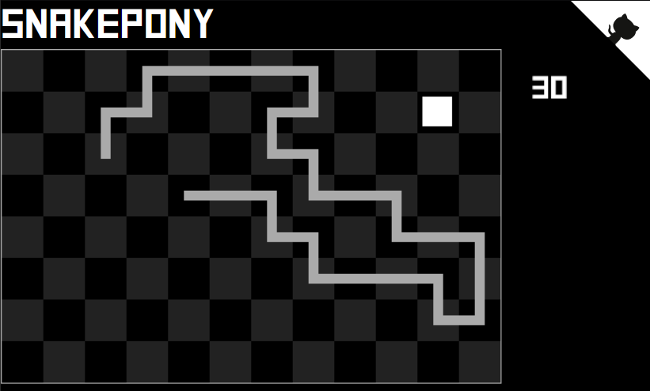

# SnakePony

A simple non-ticking snake game which supports playing with any board size.

## [Play it](https://snakepony.now.sh)

_if on computer, you can move using the mouse too_

## Size variations

Passing `?size=<number>` controls the vertical number of squares of the grid. The default is 8.
The horizontal number of squares is computed to be about 50% more than vertical.

- [SnakePony, very small](https://snakepony.now.sh/?size=4)
- [SnakePony, small](https://snakepony.now.sh/?size=6)
- [SnakePony, normal size](https://snakepony.now.sh/?size=8)
- [SnakePony, big](https://snakepony.now.sh/?size=12)
- [SnakePony, bigger](https://snakepony.now.sh/?size=16)
- [SnakePony, too big](https://snakepony.now.sh/?size=20)

## Border behavior: topology variants

Passing `?topology=<name>` controls how the border reacts to the player hitting it.

- [SnakePony, ribbon (wall + loop)](https://snakepony.now.sh/?topology=ribbon)
  - [SnakePony, alternative ribbon](https://snakepony.now.sh/?topology=long-ribbon)
- [SnakePony, mobius strip (wall + crossed)](https://snakepony.now.sh/?topology=mobius)
  - [SnakePony, alternative mobius strip](https://snakepony.now.sh/?topology=long-mobius)
- [SnakePony, klein bottle (looping+crossed)](https://snakepony.now.sh/?topology=klein)
  - [SnakePony, alternative klein bottle (looping+crossed)](https://snakepony.now.sh/?topology=long-klein)
- [SnakePony, torus (all borders looping)](https://snakepony.now.sh/?topology=torus)
- [SnakePony, real projective plan (crossed+crossed)](https://snakepony.now.sh/?topology=projective)
- [SnakePony, normal (4 wall borders)](https://snakepony.now.sh/?topology=rectangle)

Note: the topology argument can be combined with the size argument. Example:

https://snakepony.now.sh/?size=4?topology=torus

## Challenge mode

If you want to challenge yourself a bit, you can add `?showMoveCount` in the URL. It will show the number of moves you made since the beginning of the game.
[(Example link)](https://snakepony.now.sh/?size=4?showMoveCount)

## Contributing

Use `yarn install` to install the dependencies

Use `./tsc.cmd` to run typescript type checking.

Use `./parcel.cmd` to run the development server.

The project is built by now.sh using `npm run build` (on a linux machine).

## Info

The first released version, that already implemented thrifty screen refresh, took 8 hours to write.
